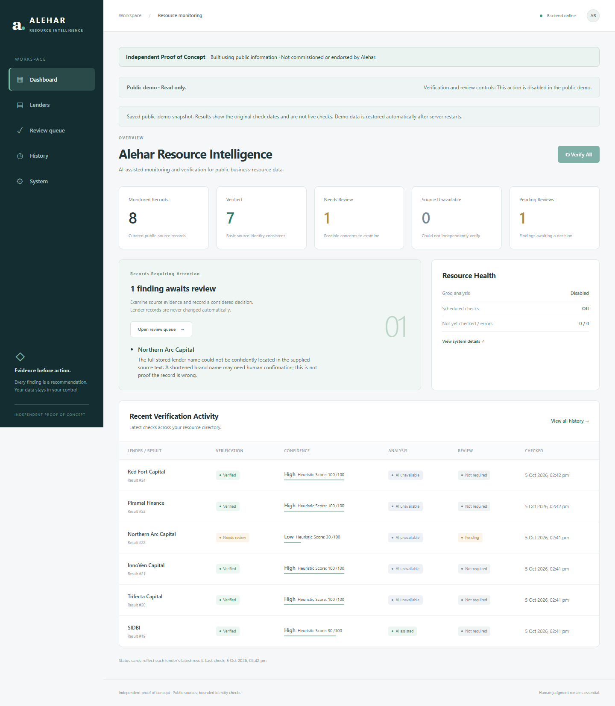
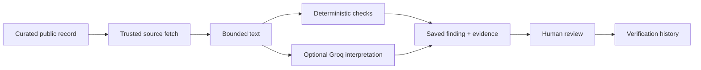
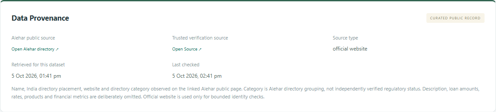
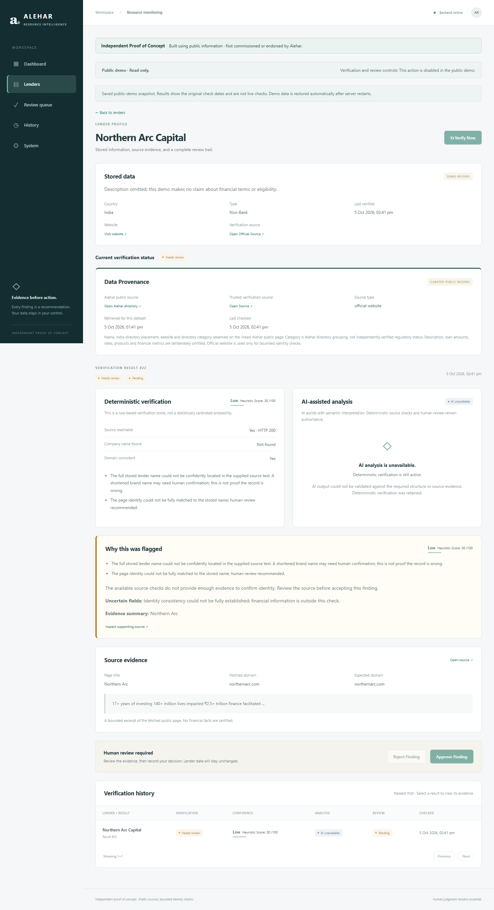

# Alehar Resource Intelligence

Independent AI-assisted proof-of-concept for monitoring and verifying public business-resource data.

The system compares curated records against trusted public sources, performs deterministic verification, uses AI for semantic interpretation, and routes uncertain findings to human review.

**Live demo:** [alehar-resource-intelligence.vercel.app](https://alehar-resource-intelligence.vercel.app). **Backend health:** [Render /health](https://alehar-resource-intelligence.onrender.com/health). **GitHub:** [cout1909/alehar-resource-intelligence](https://github.com/cout1909/alehar-resource-intelligence). **Video:** Pending recording.



## Problem and solution

Public resource directories can involve recurring manual source checks. This prototype explores a possible workflow using eight entries from Alehar's public India lender directory. It links each record to its provenance, captures bounded source evidence, and highlights uncertainty for a person to investigate. It does not claim knowledge of Alehar's internal processes or measured operational savings.

## Workflow

1. Import the small, attributed public dataset.
2. Fetch only the stored official source with bounded, SSRF-protected requests.
3. Check source reachability, company-name signals, domain consistency and content sufficiency.
4. Optionally use Groq for structured extraction and semantic interpretation.
5. Save evidence and route uncertain results to the review queue.
6. Approve or reject a **finding** locally; stored business data stays unchanged.

The dashboard shows latest record states, outstanding findings and recent activity. Detail pages distinguish current status from selected historical results, expose provenance, separate deterministic and AI findings, and explain why a record was flagged.

## Architecture



React + TypeScript + Vite frontend; FastAPI + Pydantic backend; SQLAlchemy + SQLite persistence; Requests + BeautifulSoup source processing; LangChain/Groq structured analysis; optional APScheduler; pytest and Playwright validation. No Redis, vector database, autonomous agents or task queue.

See [architecture](docs/ARCHITECTURE.md) for data boundaries, security and execution details.

## Data provenance

The [curated JSON dataset](data/alehar_demo_lenders.json) contains eight records with Alehar directory URLs, official verification URLs, source types, retrieval times and omission notes. [Public-data notes](docs/PUBLIC_DATA.md) explain selection and source attribution.

Only names, directory country/category and website links are imported. Descriptions, loan amounts, interest rates, financial metrics and regulatory claims are deliberately omitted. A directory category does not establish regulatory status. The legacy database stores an omitted description as an empty string; the source dataset uses null.

The importer is idempotent, skips non-demo records, logs additions/updates, preserves verification history and backs up populated SQLite databases. It does not delete records. The local Phase 3 database is `alehar-demo.db`; the original Phase 2 `alehar.db` is retained separately. Neither belongs in Git.



## Deterministic verification and confidence

VERIFIED means the bounded page-identity checks were consistent. It does **not** mean financial information, lending terms, eligibility, regulatory status or every field was verified.

Confidence is a rule-based 0-100 score: High >=85, Medium 50-84, Low <50. It is not a statistically calibrated probability. Domain consistency and name matching are useful signals, not proof of identity. Shortened brand names may require review.

## Groq-assisted analysis

AI extracts structured information and interprets source evidence. Exact evidence quotes are validated against supplied text; invalid output and unsupported comparisons fall back to deterministic checks. An omitted stored description cannot be reported as a successful description comparison. Other AI paraphrases remain fallible and require review.

Provider outages, rate limits, timeouts, missing configuration and validation failures are handled without discarding deterministic results. AI cannot clear deterministic warnings, change the heuristic score, approve findings or edit lender fields. No provider key is sent to the browser; tracing is disabled around provider calls.

The locally configured model is `openai/gpt-oss-20b`. Model access and quotas depend on the Groq account. See the dated [actual verification report](docs/verification-report.json), including every fallback. Do not represent fallback results as successful AI analysis.

## Human review

Reviewers inspect provenance, source evidence and uncertainty before choosing **Approve Finding** or **Reject Finding**. The decision does not certify a lender, change verification status or update business fields. Pending findings from older runs remain pending until reviewed, so the pending count can exceed the number of records whose latest result needs review.

There are no accounts, reviewer roles or attributed audit logs in this independent demo. Verification history is not a tamper-evident audit system.



## Local setup

Python 3.12 and Node.js 20 are used for validation. From the repository root, in PowerShell:

```powershell
py -3.12 -m venv .venv
.\.venv\Scripts\Activate.ps1
python -m pip install -r requirements-lock.txt
Copy-Item .env.example .env
python -m scripts.seed_alehar_demo
python run.py
```

Copy `.env.example` **only for a new setup**; preserve an existing `.env`. Import before the first start to populate curated data. The legacy `run.py` first-run seed remains for Phase 1/2 compatibility; `python -m scripts.serve` bootstraps curated records when a production database is empty.

In a second terminal:

```powershell
cd frontend
npm.cmd ci
npm.cmd run dev
```

Open `http://localhost:5173`. API: `http://127.0.0.1:8000`; health: `/health`; local docs: `/docs`.

Use `python run.py`, not bare `run.py`, in PowerShell. If port 8000 is reserved or busy, choose an available port with `python -m uvicorn app.main:app --host 127.0.0.1 --port 8010`, and configure `VITE_API_BASE_URL=http://127.0.0.1:8010` in the frontend environment before restarting Vite.

Populate results explicitly with `python -m scripts.verify_demo` or local Verify All. This makes external source/optional Groq requests; browsing and health checks do not. AI is off by default. Configure the backend key privately in `.env`, never in chat or frontend variables.

## Environment variables

[.env.example](.env.example) contains safe defaults. Key settings:

- `DATABASE_URL`: local SQLite; choose a persistent production path after hosting selection.
- `AI_ENABLED`, `AI_PROVIDER`, `GROQ_API_KEY`, `AI_MODEL`: optional backend AI.
- `PUBLIC_DEMO_MODE=false`: local write actions available; use true for public deployment.
- `ALLOWED_ORIGINS`: comma-separated exact frontend origins; falls back to `FRONTEND_ORIGIN` if empty.
- `ENABLE_DOCS`: Swagger/ReDoc/OpenAPI toggle.
- `SCHEDULER_ENABLED=false`: optional local interval checks; always disabled in public mode.
- `APP_ENV`, `LOG_LEVEL`: environment identification and logging.
- `VITE_API_BASE_URL`: frontend build-time API URL; the only frontend service setting.

All bounds, timeouts and production values are documented in [deployment](docs/DEPLOYMENT.md).

## Public demo mode and security

`PUBLIC_DEMO_MODE=true` keeps reads available while returning 403 for verification and review mutations. Verification service entrypoints and scheduler callbacks also enforce the restriction. Buttons remain visible, disabled and explained. This prevents anonymous visitors from consuming Groq quota or changing review decisions.

SSRF protections, redirect validation, bounded response/text sizes, explicit CORS and sanitized API errors remain in place. No arbitrary source URL endpoint exists. Secrets, databases, runtime captures and backups are ignored by Git and excluded from the container build context. Run `python -m scripts.security_check` before publication; it reports paths/categories without values. Its pattern scan is not a comprehensive security audit. The initial publication includes a staged-file secret/ignore review; local credentials and databases are excluded.

The local API has no authentication: keep local write mode on loopback. Public hosting must use read-only mode. Use one worker/one instance; the verification lock is in-process.

## Testing

Baseline: 96 backend tests, frontend production build and two browser workflows passed before Phase 3 changes.

Final local validation: **123 backend tests pass**; **frontend build passes**; **three browser tests pass** (two local workflow/mobile tests and one public-demo enforcement test). See [validation details](docs/PHASE3_VALIDATION.md) and the dated [live report](docs/verification-report.json). Browser tests use isolated synthetic sources; separate screenshots and live checks use the real curated dataset.

```powershell
python -m pytest -q
python -m scripts.security_check
cd frontend
npm.cmd run build
npm.cmd run test:e2e
$env:PUBLIC_BROWSER_TEST='1'
npm.cmd run test:e2e
Remove-Item Env:PUBLIC_BROWSER_TEST
```

Playwright uses installed Microsoft Edge on Windows. On Linux, install Chromium with `npx playwright install --with-deps chromium`. The GitHub workflow runs backend/build/browser checks and passed remotely. It does not deploy anything.

## Docker and deployment

The [Dockerfile](Dockerfile) uses Python slim, a non-root user, pinned dependencies, a healthcheck, one worker and safe public-demo defaults. The frontend builds as static assets with SPA fallback configuration for Vercel/Netlify.

Render successfully built and runs the Docker image. Production health, saved data, exact CORS, read-only guards, restart recovery and fresh incognito browser checks passed on 5 October 2026. Local Docker Desktop validation remains unavailable. See [deployment instructions](docs/DEPLOYMENT.md) for configuration and repeatable production checks.

The owner approved a public GitHub repository, Render Free backend and Vercel frontend with a zero-cost budget. No paid disk or database is provisioned. `render.yaml` pins `plan: free` and enables `PUBLIC_DEMO_SNAPSHOT=true`: startup restores the eight curated records and bundled dated public findings into disposable SQLite without external calls. Restarting or losing the filesystem does not lose displayable demo results. Local persistence is unchanged because this option defaults to false.

## Demo materials

- [60-90 second script](docs/DEMO_SCRIPT.md)
- [Recording guide](docs/VIDEO_RECORDING_GUIDE.md)
- [Concise pitch](docs/PITCH.md)
- [Draft message to Avinash Sir](docs/OUTREACH_MESSAGE.md) - not sent
- [Actual screenshots](docs/screenshots/)
- [Saved example routes](docs/demo-examples.json)

## Known limitations and future pilot

Only eight curated lenders and bounded page-identity signals are covered. Sites can block automated access, change content or require JavaScript. AI output can be inconsistent and provider quotas can trigger fallback. Omitted fields are not verified. Exact name matching can conservatively flag legitimate shortened brands. Historical AI output remains fallible even when source quotes passed validation. No financial recommendation or correctness guarantee is provided.

The public deployment uses a reproducible snapshot instead of persistent storage. It displays historical checks, not continuous live monitoring. Render Free can sleep and cold-start; the UI allows up to 90 seconds for reads and explains the wait. Open the demo and wait for data to load just before sharing it. Video recording remains pending.

Login, reviewer roles, attributed audit logs, approved/private datasets and approved updates are **future pilot features only after Alehar expresses interest**. Events, technology directories, notifications and reporting come only after pilot feedback. See [future pilot scope](docs/FUTURE_PILOT.md).

## License and disclaimer

A license has not been chosen. See the [MIT recommendation and ownership notes](docs/LICENSE_RECOMMENDATION.md); no license grant is implied for third-party data or branding.

This is an independent proof of concept built for Alehar using publicly available information. It was not commissioned, endorsed or supplied with private data by Alehar. Public source links are attribution, not a partnership claim. Human judgment remains essential.
