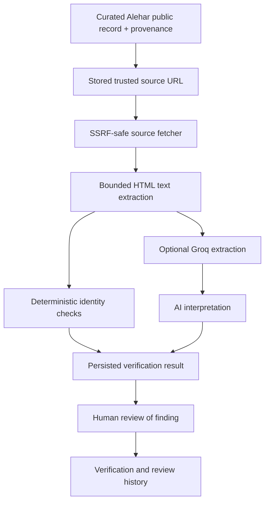

# Architecture

An independent proof of concept using public information. Alehar did not commission this application or provide private data.

## Boundaries

- React/TypeScript renders the dashboard, directory, provenance, evidence, review queue, history and system status. Vite builds static assets. The browser never receives the provider key.
- FastAPI exposes bounded read endpoints and explicit verification/review actions. `GET /health` performs no database or external request.
- SQLAlchemy persists lender records and append-only verification runs in SQLite. Review decisions update a pending result once, using an atomic conditional update. This is verification history, **not** a tamper-evident audit log or attributed multi-user review system.
- Groq is optional. LangChain provides structured extraction and interpretation, not autonomous browsing or tool execution. Tracing is explicitly disabled around provider calls.

## Provenance and import

`data/alehar_demo_lenders.json` contains eight entries observed in the [Alehar India directory](https://www.alehar.com/resources/tools/lenders/IND), with official website sources and retrieval timestamps. Names, directory country, category and links are the only imported business fields. A directory category is not a regulatory determination. Descriptions and financial information are omitted.

`python -m scripts.seed_alehar_demo` imports by exact name. Repeated imports do not duplicate rows; non-demo records are skipped. Duplicate existing names stop the import. Existing results and reviews are retained. SQLite backups precede imports into populated databases and additive provenance migrations. The legacy non-null description column represents omission with an empty string; the source JSON retains `null`.

The local Phase 3 database is `alehar-demo.db`. The original Phase 2 `alehar.db` remains separate and unchanged. Select a database through `DATABASE_URL`; neither database belongs in Git.

## Verification limits

Reachability, bounded company-name matching, domain consistency, basic description identity and challenge-page detection produce a rule-based 0–100 score. High means >=85, medium 50–84, low <50. This is **not** a calibrated probability, lending recommendation, financial validation or regulatory certification. A score of 100 can coexist with an AI concern requiring review.

Name matching normalizes punctuation, spacing and limited legal suffixes. It does not silently treat abbreviated brands as legal aliases. Northern Arc Capital is a current example: the fetched page title is Northern Arc and the full stored name is absent from the bounded extraction. That is insufficient identity evidence, not proof that Alehar's record is wrong.

AI evidence quotes must occur in the supplied text. Invalid structured output, unsupported evidence, authentication failures, rate limits and timeouts fall back to deterministic checks. AI may escalate a result to review; it cannot clear a deterministic warning, change the score, approve a finding or edit business data.

## Security and execution

Only stored source URLs are fetched; verification endpoints accept no arbitrary URL. The fetcher validates schemes, public IP addresses, redirects, response size and timeouts, retaining the existing DNS/SSRF protections. No JavaScript execution or unrestricted crawler is added.

`PUBLIC_DEMO_MODE=true` blocks all non-read HTTP methods with 403 (except OPTIONS), guards verification service entrypoints and prevents scheduler startup/callback execution. Existing results remain readable. The UI disables controls and explains the restriction. CORS accepts explicit configured origins, never a wildcard. Swagger, ReDoc and OpenAPI can be disabled. Unexpected errors return generic messages without exception details.

Runs are sequential with a configurable delay. A shared in-process lock prevents overlapping manual and scheduled verification. Deploy **one worker and one instance** with SQLite. Multiple workers would require a different coordination design; not implemented here. Frontend simultaneous GET requests are shared, history filters avoid duplicate lender requests, and browsing never initiates verification or AI calls.

## Future boundary

Authentication, reviewer roles, attributed audit logs, approved record updates, internal datasets and other resource categories are deliberately excluded. See [future pilot scope](FUTURE_PILOT.md).

## Render Free snapshot mode

`PUBLIC_DEMO_SNAPSHOT=true` requires public read-only mode. Startup restores reviewed public JSON into disposable SQLite in one transaction, preserving original source-check dates. Existing matching state is reused without duplicates; unexpected nonempty data is rejected rather than overwritten. Local behavior is unchanged when the setting is false. No network calls or AI are needed to reconstruct the demo. Source excerpts are shortened for publication and private review notes are omitted.
